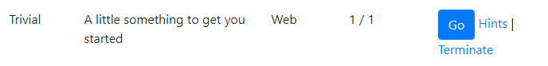
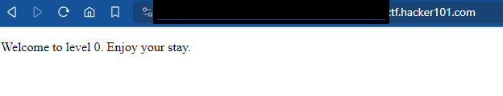
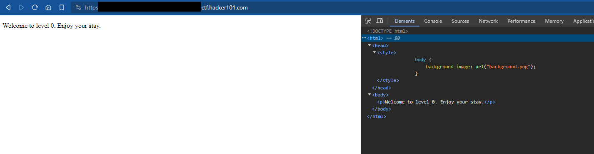

# A little something to get you started

### Website: [CTF-Hacker101](https://ctf.hacker101.com/ctf)
Date: 10/18/2023

-----------------------------------------------------------------
Task: Hunt down all the flags, example of flag given by CTF-Hacker101

[How to Play](https://ctf.hacker101.com/howtoplay)

```c
$$^FLAG^37ae568362f974017fa575f08cd215044cd6bb395c3f5e5e293ee5324ba6769c$FLAG$
```
## Let's Begin



> [!Note]
>  If you are stuck and confuse, you can use Hints. However let's try to do our CTF without using them, for those who are brand new or just starting out CTF for the first time. This would be hard if you are not bit techie sort of speaking. 

### Steps
1. Proceed to the challenge by pressing 'Go'.
2. On this site all you see if a blank screen and a url.
   

You will notice the url link is weird for the first time. However this is nothing unique.
It is a generated unique number follow by the .ctf.hacker101.com. So that when you submit
your flag it is credited to your account.

3. With nothing really standing out, right-click on the screen and 'Inspect' or simply press
   <kbd>CTRl+Shift+C</kbd>
4. You will open the **Elements** or **Source** of the website code.
5. Go ahead and resize your inspect panel, then expand all the html tags under the element tab.


Should look something like this.

6. At this point you will believe that you are stuck and there is nothing else to see. You probably click around and cannot find anything that resemble an answer to you.
   Frustrating as it is trying to find the flag string value. The answer is right in front of us.
  ```html
  background-image: url("background.png");
  ```
7. Simply copy the `background.png` and paste it at the end of your url. Example: *.ctf.hacker101.com/background.png. Then press Enter.
8. You will be directed to a page where you should see the FLAG string. Copy the entire string
   and submit the flag. [Flag Submission](https://ctf.hacker101.com/ctf/submit_flag)

You are done. 

### Conclusion
If you felt this is challenging, do not worry. There are tons of people starting of CTF or have no clue how to begin (me for example). The thing to think about is doing your best, look around, think outside the box. Things will get harder as well go into the harder difficulty. If you find this fun even though it is challenging, then proceed.

As of the time of writing (10/18/2023), this is the only CTF that the difficulty is Trivial.

